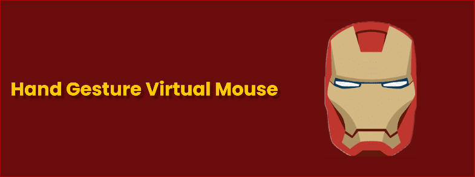

An A.I.-powered, hand gesture controlled virtual mouse

  
  
  

## Introduction
This project was inspired by the original Iron Man movie. In his workshop, Tony Stark interacts with his computers using his hands and a pen as a mouse. 

## Screenshots

## Features

- Left mouse click
- Right mouse click
- Hold left mouse click

## Demo

demo video

## How to use
1. Start with your open hand facing the camera.
2. The mouse cursor will follow the tip of your thumb. 
3. Left mouse click: Bring your index finger down towards the tip of your thumb (same x-axis)
4. Right mouse click: Bring your middle finger down towards the tip of your thumb (same x-axis)
5. Hold left mouse click: Bring your ring finger down towards the tip of your thumb (same y-axis)

## Installation

Steps

## Acknowledgements
  - Docs used: [Mediapipe documentation](https://developers.google.com/mediapipe/solutions/vision/hand_landmarker#models)

